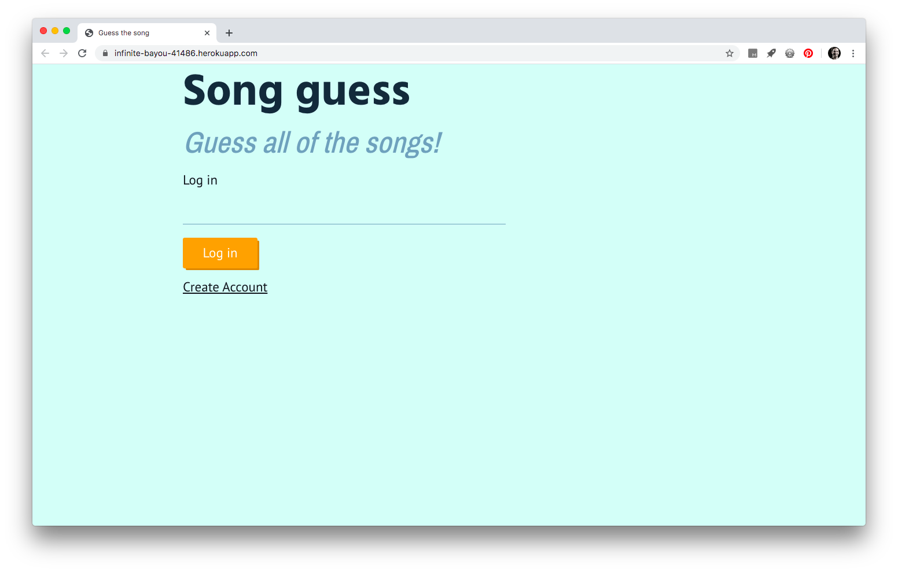

# Realtime web

[link](https://infinite-bayou-41486.herokuapp.com/)

## The product


Song guess is a multiplayer music quiz. Every round the players will be provided with a new song and you wil have to guess it. It is build with a stack of express, socket.io, handlebars and firebase

## Challenges
The biggest challenge was the combination of passing data and events between the clients.
In a game, it's hard to keep track of who just entered the game and who is already playing it for a couple of rounds. Besides that, how can you provide the clients with a new song every 30 seconds.

### The api
The first challenge was to provide every client with a new song url after 30 seconds. I've researched a couple of ways to do this. For example, the Spotify api was a good option to good with. But the only thing I really needed was an Api of which I could fetch song preview links from without much of the authentication hassle.
Eventually I've found the itunes api. With some handy helper functions I've managed to let the server fetch a new random song api.

There is a artist object under the utils function.

```js
module.exports = {
  pop: [
    'katyperry',
    'rihanna',
    'robbiewilliams',
    'johnlegend',
    'ladygaga'
  ],...
```
Everytime I fetch the api, I randomly select an artist from this object and incorporate it in the fetch url. This gives me back a couple of songObjects, containing a previewUrl.

```js
  let randomIndex = Math.floor(Math.random() * artists.festival.length);
  let randomArtist = artists.festival[randomIndex]

  let url = `https://itunes.apple.com/search?term=${randomArtist}&entity=song&limit=10`

  let results = await axios.get(url)
  .then(res => {
   let i = Math.floor(Math.random() * 10);
   let track = {
     url: res.data.results[i].previewUrl,
     artist: res.data.results[i].artistName,
     name: res.data.results[i].trackName
   }
    return track
```

After this I can emit the previewUrl to every client, so that they will be playing on the same song in the game.


### Express session in sockets
In this game, I rely on having acces to the username of a player. I need this username so that the server can determine which's players score has be updated in the database.
To solve this problem I've made use of the `express session` npm package. But I've discoverd that I have to extend this session package to use it with socket connections.
The session gets wrapped in the socket.io instance, so that I can acces `req.session.username` on a individual socket connection.

```js
io.use(sharedsession(session, {
  autoSave: true
}));
```

### persistent storage
After the track gets fetched from the api, I emit the url to the clients. But after that happens, the data of this track is no longer accesible by the server. I needed to store the track on the server so that I can compare the user's answer with the real track.
Everytime a track gets fetched, I store the information on the server itself using `node-persist`. This is a npm package that makes use of the node js filesystem to store and read a small json file. It's workings can be compared with the localStorage browser api.

```js
let track = await newTrack.fetch()
// track information get stored
await storage.setItem('track', track)

io.emit('renew-trackUrl', track)
```

```json
// data that get stored
  {"key":"track",
    "value":
    {
      "url":"https://audio-ssl.itunes.apple.com/itunes-assets/Music/3f/2b/ab/mzm.oxyukhgx.aac.p.m4a",
      "artist":"Motörhead",
      "name":"I Ain't No Nice Guy"}
    }
  }
```

## To do
There is still alot to do. At this moment it is a really minimal prototype.
* [ ] - Show total scores of all players
* [ ] - Make a custom video player. Users can cheat by editing the scroll bar
* [ ] - Make all of the individual rooms working. According to it's genre.
* [ ] - spice up the whole design of the application